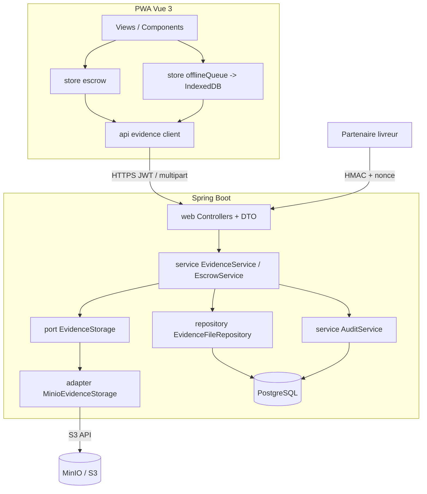
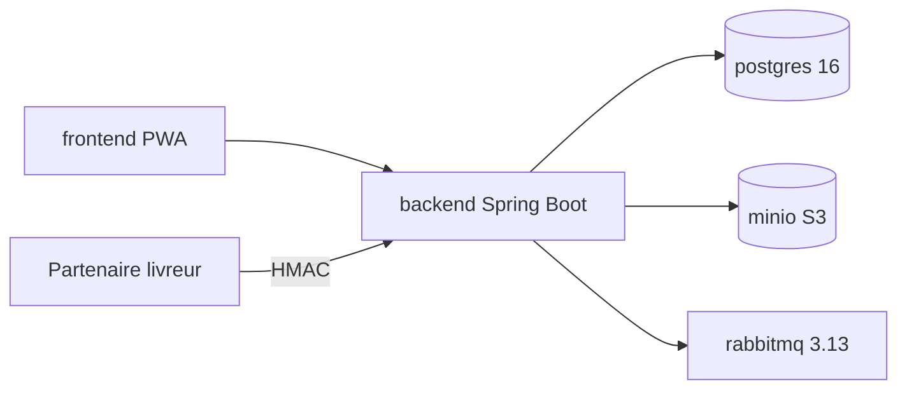
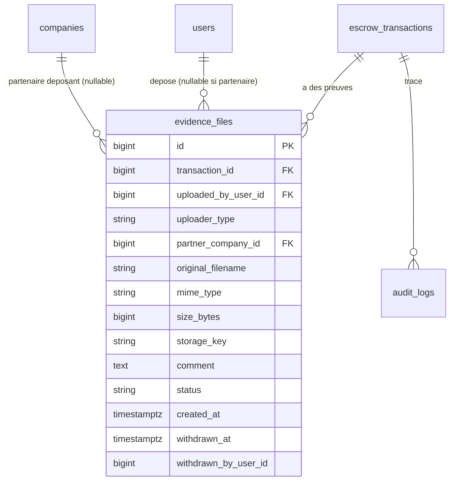

# Architecture Spine — Evidence Upload

> Slice **brownfield** greffée sur la plateforme Escrow existante. La règle : **ratifier** les conventions déjà présentes dans `backend/` et `frontend/`, ne créer un invariant que là où deux unités bâties indépendamment pourraient diverger. Les décisions `[ADOPTED]` sont imposées par le code ou une réalité existante ; les autres ont été tranchées en coaching (rationale dans `.memlog.md`).

## Design Paradigm

**Backend — architecture en couches (package-by-layer), déjà en place sous `com.zlecaf.escrow`**, augmentée d'**un seul port hexagonal** pour isoler le stockage binaire :

| Couche | Paquet | Rôle | Ajouts de cette feature |
| --- | --- | --- | --- |
| Web | `web/` (+ `web/dto/`) | Controllers minces, DTOs (records), enveloppe d'erreur globale | `EvidenceController`, `PartnerEvidenceController`, `EvidenceDtos` |
| Service | `service/` | Orchestration métier, **détient toutes les frontières `@Transactional`** | `EvidenceService`, extension d'`EscrowService` pour l'ouverture composite |
| Port stockage | `service/storage/` | **Interface `EvidenceStorage`** (put/get par clé opaque) | `EvidenceStorage` + adaptateur `MinioEvidenceStorage` |
| Repository | `repository/` | Spring Data JPA | `EvidenceFileRepository` |
| Domain | `domain/` | Entités JPA + enums | `EvidenceFile`, enums `UploaderType`, `EvidenceStatus` |

**Frontend — Vue 3 / Pinia / PWA, déjà en place.** Cette feature étend le store `escrow` (dépôt/consultation) et **refond le store `offlineQueue`** (localStorage → IndexedDB pour porter le binaire).

## Inherited Invariants

Contraintes héritées de la plateforme existante — **read-only**, non renégociables ici. Une décision locale qui les contredit est un **conflit à remonter**, pas une dérogation.

| Hérité | Source | Ce que ça contraint ici |
| --- | --- | --- |
| Injection par constructeur, controllers minces, `@Transactional` dans le service | `backend/` (convention) | Tout nouveau code preuve suit ce découpage |
| Entités `@Entity @Table(snake_case_plural)`, `@GeneratedValue(IDENTITY)`, `@Version`, `TIMESTAMPTZ` | `domain/*` | `EvidenceFile` copie ces idiomes |
| DTOs = records imbriqués dans un holder ; `XxxRequest` / `XxxDto` + `static from()` | `web/dto/*` | `EvidenceDtos` suit ce moule |
| Enveloppe d'erreur `{timestamp,status,error,message}` + `ApiExceptions` (404/400/403/409) | `GlobalExceptionHandler`, `ApiExceptions` | Aucun nouvel handler ; lever les exceptions existantes |
| Migrations Flyway `V<n>__desc.sql`, `ddl-auto=none` | `resources/db/migration/` | La table = `V2__evidence_files.sql` |
| Principal `AuthPrincipal(userId,email,role)` via `@AuthenticationPrincipal` ; routes `authenticated()` par défaut | `security/*`, `SecurityConfig` | Endpoints utilisateurs sécurisés sans config supplémentaire |
| Machine à états `INITIATED→FUNDS_LOCKED→SHIPPED→RELEASED`, branches `DISPUTED→RELEASED/REFUNDED` ; `OPEN_DISPUTE` depuis `FUNDS_LOCKED` **et** `SHIPPED` | `EscrowStateMachine`, PRD | Fenêtre de dépôt et verrou (AD-2) s'y alignent |
| Audit `audit_logs` : writer unique `AuditService`, `payload` JSONB schemaless, `recordSuccess` (MANDATORY) / `recordFailure` (REQUIRES_NEW) | `AuditService`, `AuditLog` | AD-5 réutilise ce mécanisme |
| Util `HmacSigner.sign/verify` (constant-time), en-tête `X-Escrow-Signature` | `HmacSigner`, `WebhookService` | AD-8 réutilise l'util, ajoute nonce+timestamp |

## Invariants & Rules

Le cœur durable : décisions qu'un futur développeur ne pourrait pas déduire d'un code déjà conforme. `[ADOPTED]` = imposé par le code/réalité existante.

### AD-1 — Ouverture de litige **composite et atomique**
- **Binds:** FR-6, FR-15
- **Prevents:** un litige `DISPUTED` sans aucune preuve (fenêtre non-atomique) ; un rejeu offline scindé en deux entrées désynchronisables.
- **Rule:** `POST /api/v1/escrow/{id}/dispute` (multipart : **`files[]` 1..N** + `comment` + `clientCapturedAt` optionnel) **ouvre le litige ET attache la/les preuve(s) dans une seule unité `@Transactional`**. La cardinalité `1..N` s'aligne sur AD-9 (rejeu offline pouvant porter plusieurs pièces) ; `clientCapturedAt` (ISO-8601) donne le canal exigé par AD-5/AD-11 pour un dépôt offline différé. L'événement `OPEN_DISPUTE` n'existe **pas** comme endpoint indépendant sans pièce. Le commentaire d'ouverture est obligatoire, ≥ 10 caractères (FR-2).

### AD-2 — Fenêtre de dépôt **fondée sur l'état** (pas sur l'événement)
- **Binds:** FR-1, FR-7, FR-8
- **Prevents:** dépôt/retrait sur une transaction figée financièrement ; deux endpoints avec des règles de fenêtre divergentes.
- **Rule:** dépôt et retrait autorisés **ssi `state ∈ {FUNDS_LOCKED, SHIPPED, DISPUTED}`**. Verrou dès `state ∈ {RELEASED, REFUNDED}` — s'applique aussi bien après arbitrage (`RESOLVE_*`) qu'après libération normale (`DELIVERY_CONFIRMED`). Contrôle **côté serveur**, jamais dérivé du dernier événement.

### AD-3 — Contrôle d'appartenance **unique et centralisé** (anti-IDOR)
- **Binds:** FR-1, FR-5, FR-7, FR-9, FR-11, FR-12
- **Prevents:** référence directe d'objet non contrôlée ; deux endpoints avec des règles d'accès divergentes.
- **Rule:** tout endpoint preuve (dépôt, liste, téléchargement, retrait) charge d'abord la transaction et passe par le **même** contrôle « X est-il partie de Y ? » (`resolveRole`/`authorizeView` existants → `ForbiddenException`). Le téléchargement **vérifie en plus `{eid}.transaction_id == {id}` de l'URL** avant de servir le binaire.

### AD-4 — Immuabilité : **retrait logique uniquement**, avec plancher
- **Binds:** FR-12, FR-13, FR-14, NFR-3
- **Prevents:** perte de preuve ; un litige « vidé » de ses pièces ; retrait de la pièce d'un tiers.
- **Rule:** aucune suppression physique. Un déposant ne retire que **sa propre** pièce (`status ACTIVE→WITHDRAWN`, `withdrawn_at`/`withdrawn_by` renseignés) ; la pièce reste visible comme « retirée ». Tant que `state = DISPUTED`, un retrait est **refusé (409)** s'il ferait passer le nombre de pièces `ACTIVE` **toutes parties confondues** (buyer/seller/admin/carrier) **sous le plancher FR-6** (≥ 1) — décision POC : une preuve partenaire ou de la partie adverse compte dans le plancher. Rétention illimitée (POC).

### AD-5 — Audit **dans la même transaction**, via enrichissement du payload
- **Binds:** FR-13, NFR-3
- **Prevents:** divergence du schéma d'audit ; écriture d'audit hors de la transaction métier.
- **Rule:** chaque dépôt/retrait écrit une entrée `audit_logs` via `AuditService.recordSuccess` en **propagation MANDATORY** (commit atomique avec l'opération). Le `payload` JSONB porte `action ∈ {EVIDENCE_ADDED, EVIDENCE_WITHDRAWN}`, `evidenceId`, `sha256`, et — pour un dépôt offline différé — l'heure client de capture. **Pas** de colonne `action_type` ajoutée.

### AD-6 — Stockage binaire derrière le **port `EvidenceStorage`** (clé opaque)
- **Binds:** NFR-1
- **Prevents:** couplage des controllers/service au backend de stockage ; migration future impossible sans casser le contrat d'API.
- **Rule:** le binaire n'est jamais manipulé que via l'interface `EvidenceStorage` (`store(bytes, contentType) → storageKey`, `load(storageKey) → stream`). La clé est **opaque** (`{transaction_id}/{uuid}`), **jamais dérivée du nom de fichier fourni**. Implémentation POC = `MinioEvidenceStorage` (S3-compatible). Aucun code hors de l'adaptateur ne connaît MinIO/S3.

### AD-7 — Validation **serveur** stricte à l'ingestion
- **Binds:** FR-3, FR-4, NFR-2
- **Prevents:** injection d'un type non autorisé via extension/Content-Type mentis ; path traversal ; XSS stocké ; fichier vide/oversize.
- **Rule:** côté serveur, toujours : (1) **content-sniffing** du MIME réel (impl. Apache Tika, cf. Stack), confronté à extension + `Content-Type` déclaré, rejet **400** si incohérence ou type ∉ `{image/jpeg, image/png, application/pdf}` ; (2) taille **`0 < size ≤ 10 485 760`**, **arbitrée par le service** : la limite multipart Spring est réglée **> 10 Mo** et `MaxUploadSizeExceededException` est mappée **→ 400** dans le handler global, pour une enveloppe d'erreur uniforme (jamais 413/500) ; (3) nom de stockage **généré** (UUID), nom fourni seulement conservé en métadonnée assainie ; (4) restitution en **`Content-Disposition: attachment`**, jamais *inline*.

### AD-8 — Dépôt partenaire : **HMAC entrant durci** (clé dédiée + anti-rejeu)
- **Binds:** FR-5, NFR-5
- **Prevents:** rejeu d'une requête interceptée ; réutilisation du secret webhook *sortant* en entrée ; dépôt sur une transaction tierce.
- **Rule:** `POST /api/v1/partner/escrow/{id}/evidence` (route `permitAll` façon `/webhooks/incoming/**`, auth par signature). En-têtes : **key-id partenaire** + `X-Escrow-Signature` + timestamp + **nonce**. La signature (util `HmacSigner`, clé **dédiée entrante par partenaire**, ≠ secret sortant) **couvre corps + métadonnées + timestamp**. Anti-rejeu **figé** : fenêtre timestamp **±5 min** ; unicité du nonce **scindée par key-id** (clé composite `(key_id, nonce)`) ; **rétention des nonces ≥ durée de fenêtre** (purge < 5 min interdite, sinon fenêtre de rejeu). Rejet **401/403** si nonce déjà vu pour ce key-id, ou timestamp hors fenêtre. Vérifier que la `companies` du partenaire (via key-id) **est impliquée** dans la transaction `{id}`, sinon **403**.

### AD-9 — Hors-ligne : **une entrée de file atomique portant le binaire** (IndexedDB)
- **Binds:** FR-15, NFR-4
- **Prevents:** dépassement du quota localStorage ; ouverture de litige offline scindée ; perte silencieuse de fichier.
- **Rule:** le store `offlineQueue` migre de **localStorage vers IndexedDB** pour porter des `Blob` (≤ 10 Mo). Une ouverture de litige offline = **une seule entrée** contenant l'action + le(s) binaire(s), rejouée en **multipart** vers l'endpoint composite (AD-1). L'UI affiche l'état `DISPUTED` de façon **optimiste** en attendant.

### AD-10 — Synchro : **réconciliation transitoire vs permanent** (remplace le `break` aveugle)
- **Binds:** FR-16
- **Prevents:** boucle de retry infinie sur un 4xx permanent ; état optimiste mensonger ; perte silencieuse d'un fichier en attente.
- **Rule:** au `flush()`, classer chaque échec de rejeu **par le code applicatif de l'enveloppe d'erreur, jamais par la seule classe HTTP** (un `409` est ambigu). **Transitoire** (⇒ conserver l'entrée + binaire, re-tenter) : offline / réseau, `5xx`, `408`, `429`, et **`409` optimistic-lock** (`@Version`). **Permanent** (⇒ **annuler l'affichage optimiste**, **conserver** l'entrée + binaire, **notifier** avec motif + état réel, **stopper l'auto-retry**) : un ensemble **énuméré** de codes applicatifs (ex. `DISPUTE_ALREADY_RESOLVED`, `EVIDENCE_INVALID`, `WINDOW_CLOSED`). **Aucun fichier n'est perdu silencieusement.**

### AD-11 — Horodatage : **serveur source de vérité**, client conservé
- **Binds:** FR-10
- **Prevents:** ordre chronologique faussé par des horloges clientes divergentes (surtout dépôts offline différés).
- **Rule:** `created_at` = **heure serveur à la réception** ; c'est la clé du tri chronologique (index `(transaction_id, created_at)`). L'heure client de capture est conservée dans le `payload` d'audit (AD-5), jamais utilisée pour l'ordre.

### Direction des dépendances


*Règle de dépendance : `web → service → {repository, AuditService, port}` ; seul l'adaptateur connaît MinIO. Jamais de dépendance remontante (repository/domain n'importent pas web/service).*

## Invariants de test

La slice greffe sur du code déjà couvert : tout AD qui modifie ce code **étend le test existant**, il ne le contourne pas.

| Invariant | Test | Ce qu'il doit prouver |
| --- | --- | --- |
| AD-2 (fenêtre d'état) | étend `EscrowStateMachineTest` | dépôt/retrait acceptés ssi `state ∈ {FUNDS_LOCKED, SHIPPED, DISPUTED}`, refusés en terminal |
| AD-8 (anti-rejeu HMAC) | étend `HmacSignerTest` | signature couvre corps+timestamp ; nonce rejoué (même key-id) rejeté ; timestamp hors ±5 min rejeté |
| AD-1 (atomicité composite) | nouveau test transactionnel | échec de persistance de la pièce ⇒ **pas** de transition `DISPUTED` **et** aucune ligne `evidence_files` (rollback complet) |
| AD-10 (réconciliation) | nouveau test front (store) | un `409`-lock est re-tenté ; un code applicatif permanent gèle l'entrée sans perdre le binaire |

## Consistency Conventions

| Concern | Convention |
| --- | --- |
| Nommage entités/tables | Entité `EvidenceFile` → table `evidence_files` ; enums `UploaderType {BUYER, SELLER, ADMIN, CARRIER_PARTNER}`, `EvidenceStatus {ACTIVE, WITHDRAWN}` en `VARCHAR` |
| Nommage services/web | `EvidenceService`, `EvidenceController`, `PartnerEvidenceController`, `EvidenceDtos` (records `UploadEvidenceRequest`, `EvidenceFileDto` + `static from()`), port `EvidenceStorage` + `MinioEvidenceStorage` |
| Endpoints | Imbriqués sous la ressource escrow : `POST/GET /api/v1/escrow/{id}/evidence`, `GET .../evidence/{eid}/download`, `POST .../evidence/{eid}/withdraw`, `POST /api/v1/escrow/{id}/dispute` (composite), `POST /api/v1/partner/escrow/{id}/evidence` (HMAC) |
| Contrat multipart partagé | Noms de champs **figés**, identiques sur composite / plain / partenaire (et rejeu offline) : fichier(s) = **`files[]`** (1..N), commentaire = **`comment`**, heure de capture = **`clientCapturedAt`** (optionnel, ISO-8601). Deux implémentations divergentes de ces noms = 400 au rejeu → interdit. |
| Données & formats | Ids `BIGSERIAL`/`IDENTITY` ; `created_at`/`withdrawn_at` `TIMESTAMPTZ` ; `mime_type` contraint ∈ {image/jpeg,image/png,application/pdf} ; `size_bytes` `BIGINT ≤ 10485760` ; `storage_key` = `{transaction_id}/{uuid}` opaque ; erreurs = enveloppe globale existante |
| État & transverse | `@Transactional` dans le service ; contrôle d'appartenance (AD-3) **avant** toute opération ; audit MANDATORY même transaction (AD-5) ; restitution binaire en `Content-Disposition: attachment` (AD-7) ; auth = JWT (utilisateurs) / HMAC+nonce (partenaire) ; config via `${ENV:default}` |

## Stack

| Name | Version |
| --- | --- |
| Java | 21 |
| Spring Boot | 3.3.5 *(voir Deferred : ligne 3.x EOL)* |
| PostgreSQL | 16 |
| Flyway (+ flyway-database-postgresql) | via BOM Spring Boot |
| hypersistence-utils-hibernate-63 (JSONB) | existant |
| Apache Tika (`org.apache.tika:tika-core`) | 3.3.1 |
| AWS SDK for Java v2 (`software.amazon.awssdk:s3`) | 2.47.6 |
| MinIO (conteneur, S3-compatible) | `minio/minio:RELEASE.2025-09-07T16-13-09Z` |
| RabbitMQ | 3.13 |
| Frontend : Vue 3 + Pinia + Vite/PWA + Tailwind | existant |

## Structural Seed

### Vue conteneurs / déploiement (docker-compose)


*Un service `minio` est ajouté à `infra/docker-compose.yml` (avec volume + bucket `escrow-evidence` provisionné). Endpoint/credentials injectés au backend via variables d'environnement.*

### ERD cœur (noms + relations)


*Table net-new `evidence_files` (migration `V2`). Le stockage des clés HMAC entrantes dédiées et des nonces anti-rejeu partenaire (table dédiée vs colonnes sur `companies`) est laissé au code ; AD-8 en fixe le contrat de sécurité, pas le schéma.*

### Arbre source (ajouts)

```text
backend/src/main/java/com/zlecaf/escrow/
  domain/       EvidenceFile.java, UploaderType.java, EvidenceStatus.java
  repository/   EvidenceFileRepository.java
  service/      EvidenceService.java  (+ extension EscrowService : ouverture composite)
    storage/    EvidenceStorage.java (port), MinioEvidenceStorage.java (adapter)
  web/          EvidenceController.java, PartnerEvidenceController.java
    dto/        EvidenceDtos.java
backend/src/main/resources/db/migration/  V2__evidence_files.sql
frontend/src/
  stores/       offlineQueue.js  (refonte localStorage -> IndexedDB, porte les Blobs)
  api/          evidence.js
  components/    EvidenceList.vue, EvidenceUpload.vue
infra/docker-compose.yml   (+ service minio)
```

## Capability → Architecture Map

| Exigence / Domaine | Vit dans | Gouverné par |
| --- | --- | --- |
| Dépôt de pièces (FR-1..4) | `EvidenceController` → `EvidenceService` → `EvidenceStorage` | AD-2, AD-6, AD-7 |
| Ouverture de litige + preuve (FR-6, FR-2) | `POST /escrow/{id}/dispute` composite | AD-1 |
| Dépôt partenaire (FR-5) | `PartnerEvidenceController` | AD-8 |
| Consultation / téléchargement (FR-9, FR-10, FR-11) | `EvidenceController` (liste + download) | AD-3, AD-7, AD-11 |
| Retrait logique + plancher (FR-12, FR-14) | `EvidenceService.withdraw` | AD-4 |
| Audit (FR-13) | `AuditService` (payload enrichi) | AD-5 |
| Verrou terminal (FR-8) | garde d'état dans `EvidenceService` | AD-2 |
| Hors-ligne + synchro (FR-15, FR-16) | stores `offlineQueue` / `escrow` (PWA) | AD-9, AD-10 |
| Stockage (NFR-1) | port `EvidenceStorage` + `MinioEvidenceStorage` | AD-6 |
| Sécurité fichiers (NFR-2) | validation `EvidenceService` + restitution controller | AD-7 |

## Deferred

- **Montée de version Spring Boot** — 3.3.5 est sur une ligne 3.x désormais EOL (3.5.x EOL 30/06/2026 ; stable actuelle 4.1.0). Dette technique **hors-périmètre** de cette feature ; à planifier séparément (migration transverse).
- **Scan antivirus/anti-malware** (NFR-6) — risque explicitement accepté pour le POC ; s'insérera dans `EvidenceService` avant `EvidenceStorage.store` quand adopté.
- **Chiffrement par fichier au repos** — évolution ; le port `EvidenceStorage` en absorbera l'ajout sans toucher aux endpoints.
- **Backend de stockage définitif** — MinIO OSS archivé (avr. 2026) ; grâce à AD-6 + client S3 standard, bascule (AWS S3 managé, Garage, SeaweedFS) triviale. Non tranché ici. **NB (2026-07-16)** : le tag initialement épinglé `RELEASE.2025-10-15T17-29-55Z` n'existait pas sur Docker Hub (recherche web erronée) ; corrigé en `RELEASE.2025-09-07T16-13-09Z` (dernière release publiée) lors de l'implémentation de la Story 1.1.
- **Livreur en acteur interactif complet** (rôle `CARRIER` avec écrans/compte) — post-POC ; l'intégration partenaire machine (AD-8) le préfigure.
- **Plafond dur du nombre de pièces** — non fixé (limite souple indicative ~20, PRD §8).
- **Miniatures / prévisualisation PWA** — optionnel, non requis POC.
