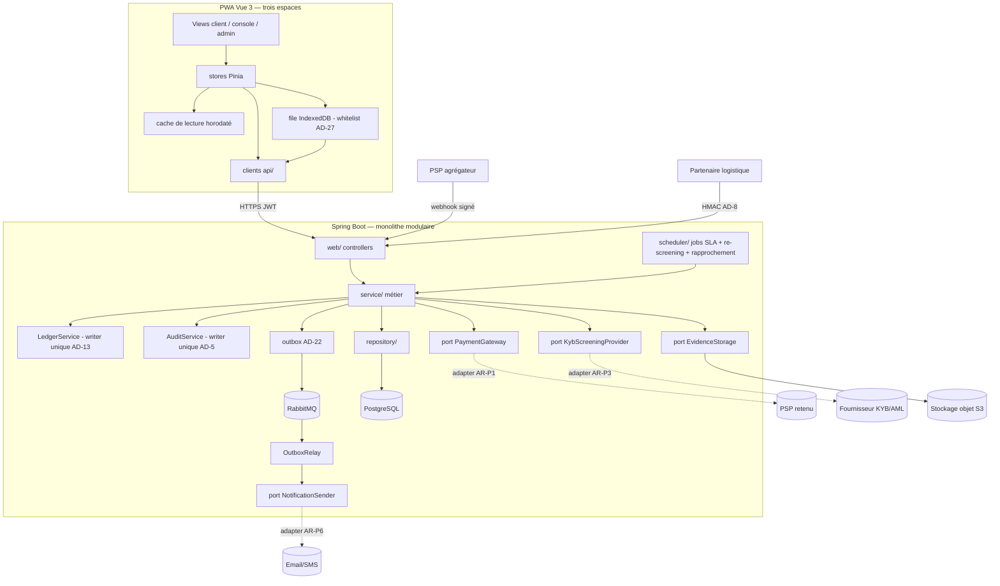
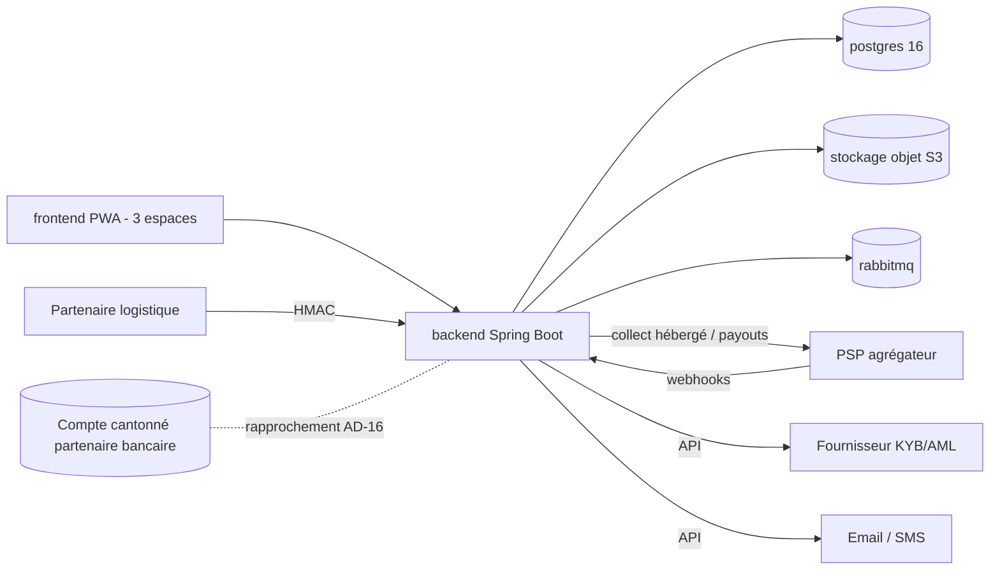
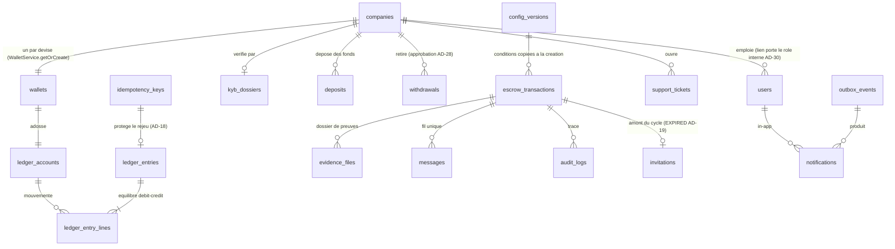

# Architecture Spine — Escrow ZLECAf (production)

> Spine **initiative** : il gouverne l'ensemble du backlog production et **hérite** du spine feature Evidence Upload (2026-07-15) dont les AD-1..12 restent contraignants, jamais renumérotés. Brownfield : les conventions du code existant sont ratifiées, pas réinventées. Rationale dans `.memlog.md` ; revues du gate dans `reviews/`.

## Design Paradigm

**Backend — monolithe modulaire Spring en couches (package-by-layer, existant sous `com.zlecaf.escrow`), avec un port hexagonal par fournisseur externe.** La règle de l'existant (`web → service → {repository, AuditService, ports}`) s'étend au périmètre production :

| Couche | Paquet | Rôle | Ajouts production |
| --- | --- | --- | --- |
| Web | `web/` (+ `web/dto/`) | Controllers minces, DTOs records, enveloppe d'erreur + `code` | wallet, KYB, messagerie, admin, notifications, webhooks PSP, pages légales publiques |
| Service | `service/` | Orchestration métier, frontières `@Transactional` | `LedgerService` (writer comptable unique), `WalletService`, `KybService`, `MessagingService`, `ConfigService`, `DepositService`, `WithdrawalService`, `OutboxRelay` |
| Scheduler | `scheduler/` (existant) | Jobs SLA, re-screening AML, rapprochement, purge de nonces | jobs FR-P12, FR-P8, AD-16 |
| Ports | `service/storage/`, `service/payment/`, `service/kyb/`, `service/notify/` | Interfaces vers l'externe | `EvidenceStorage` (existant), `PaymentGateway`, `KybScreeningProvider`, `NotificationSender` |
| Repository | `repository/` | Spring Data JPA | repositories des nouvelles entités |
| Domain | `domain/` | Entités JPA + enums | wallet/ledger, KYB, messages, config versionnée, notifications, outbox |

**Frontend — PWA Vue 3 / Pinia unique, trois espaces sous la même auth JWT + rôles** (app client mobile-first, console d'arbitrage et back-office `/admin` desktop-first — UX-DR20). Fondation : tokens CSS de `DESIGN.md` (contrat), i18n EN/FR par clés, composants partagés ; couche offline à **deux briques** (cache de lecture + file de rejeu — AD-27).

## Inherited Invariants

Du spine Evidence Upload (2026-07-15) — **read-only**, une contradiction locale est un conflit à remonter :

| Hérité | Du parent | Contraint ici |
| --- | --- | --- |
| AD-1 (litige composite atomique), AD-2 (fenêtre fondée sur l'état), AD-3 (anti-IDOR centralisé), AD-4 (retrait logique + plancher), AD-5 (audit même transaction), AD-6 (port `EvidenceStorage`, cleanup rollback), AD-7 (validation ingestion + `attachment`), AD-8 (HMAC entrant durci), AD-9 (file IndexedDB atomique), AD-10 (réconciliation transitoire/permanent via champ `code`), AD-11 (horodatage serveur), AD-12 (intégrité `evidence_files` en base) | ARCHITECTURE-SPINE Evidence Upload | Toute nouvelle story de preuve, litige, offline ou partenaire ; la brique upload est réutilisée par KYB (justificatifs), tickets et preuves de virement |
| Machine à états `EscrowStateMachine` (matrice whitelist, source unique) ; writer d'audit unique `AuditService` (MANDATORY / REQUIRES_NEW) ; `HmacSigner` constant-time ; enveloppe d'erreur globale + `code` machine ; Flyway `V<n>__desc.sql`, `ddl-auto=none` ; `AuthPrincipal` ; DTOs records + `static from()` | Invariants hérités du parent | Tout nouveau code backend |

## Invariants & Rules

### AD-13 — Grand livre en partie double, writer unique, solde dérivé
- **Binds:** FR-P3, FR-P25, FR-P42, NFR-P25
- **Prevents:** deux chemins de mutation d'un solde ; un solde stocké divergeant des écritures ; écritures modifiées après coup — y compris par le canal migrations.
- **Rule:** toute valeur monétaire naît d'une **écriture de grand livre équilibrée** (lignes débit/crédit, montants > 0, équilibre par écriture) passée par le **seul** `LedgerService`. Le solde d'un wallet est **dérivé** des écritures (jamais de colonne solde autoritative ; un cache éventuel est reconstructible, non source de vérité). Immuabilité **tenue en base** : aucun UPDATE/DELETE applicatif (trigger + rôle DB applicatif sans privilège UPDATE/DELETE sur les tables d'écritures ; les migrations Flyway sur ces tables sont limitées au schéma, jamais aux données — toute correction de données passe par une **contre-passation** via `LedgerService`, motivée et auditée). Idempotence par **référence métier unique**. Solde jamais négatif, prouvé par test de concurrence sur base réelle. La provision d'un wallet passe par l'unique `WalletService.getOrCreate` idempotent (unicité company+currency) — aucun autre code ne crée de wallet.

### AD-14 — Monnaie : NUMERIC, USD pivot, conversion aux frontières uniquement
- **Binds:** FR-P5, FR-P6, FR-P26
- **Prevents:** montants en flottants ; conversions internes silencieuses créant un risque FX plateforme ; devises non réglables ; taux d'affichage traités comme contractuels.
- **Rule:** montants en `NUMERIC(19,2)` `[ASSUMPTION : 2 décimales — USD seul au MVP]` + devise en FK vers la table ISO-4217 des devises réglables (seedée `USD`). Wallets et contrats **en USD**. La conversion n'existe qu'aux **frontières** (dépôt : taux courant PSP ; retrait : taux du jour d'exécution) ; montant et conditions du contrat **figés** ; remboursement au montant figé — aucun risque FX interne. **Aucun spread plateforme au MVP** `[ASSUMPTION]` — la marge FX est celle du PSP ; si un spread devient produit, il naît comme écriture de produits dédiée au grand livre. L'équivalent devise locale affiché (UX-DR37) est un **taux de référence indicatif** servi par le backend (source : `PaymentGateway`, rafraîchi périodiquement), jamais contractuel, toujours marqué « ≈ ».

### AD-15 — Réservation de retrait = écriture comptable
- **Binds:** FR-P43, NFR-P25
- **Prevents:** double-engagement des mêmes fonds par un financement et un retrait concurrents ; « réservations » en flag applicatif invisibles du grand livre.
- **Rule:** la demande de retrait débite le disponible vers un **compte de réservations** par écriture de grand livre ; `disponible = solde − réservations`. Le rejet restitue par **écriture inverse référencée** ; l'exécution transforme la réservation en débit définitif référençant le payout PSP. Jamais de payout sans réservation préalable, jamais de débit définitif sans confirmation du payout.

### AD-16 — Rapprochement de ségrégation : invariant contrôlé et bloquant
- **Binds:** NFR-P25, NFR-P13, FR-P3
- **Prevents:** dérive silencieuse entre grand livre interne et compte cantonné partenaire ; circuit financier mis en service sans son alarme.
- **Rule:** un contrôle planifié **et** déclenchable vérifie `somme(soldes wallets) + somme(séquestres) + somme(réservations) + somme(fonds en transit PSP) = compte miroir du cantonnement`. Tout écart émet une **alerte bloquante** (métrique dédiée + événement d'audit) ; chaque exécution est historisée. **Critère d'entrée dur : le circuit financier (Epic 4) ne se déploie en staging/production qu'avec la règle d'alerte active (Story 11.4)** — contrainte d'ordonnancement inter-pistes à porter au plan de sprint. Fréquence (tranchée par AR-P2, 2026-07-25) : **quotidien fin de jour ouvrable sur tous les corridors au MVP** + exécution déclenchable — c'est le plancher réglementaire réel (le « cantonnement continu UEMOA » anticipé s'avère être un rapprochement quotidien EOD obligatoire, Instruction BCEAO 001-01-2024 art. 48.4) ; le paramètre par corridor reste disponible pour resserrer si un partenaire l'exige.

### AD-17 — Port `PaymentGateway` : parcours hébergés, webhooks signés, idempotence par référence PSP
- **Binds:** FR-P1, FR-P43, NFR-P22, FR-P26
- **Prevents:** donnée carte transitant par la plateforme ; couplage du domaine au PSP ; double crédit sur rejeu de webhook.
- **Rule:** tout encaissement passe par le **parcours hébergé/tokenisé** du PSP — aucune saisie carte dans nos écrans ni nos serveurs. Le domaine ne connaît que le port `PaymentGateway` (initier collect, initier payout, obtenir taux appliqué et taux de référence, vérifier un webhook) ; l'adaptateur concret est choisi au spike AR-P1. Webhooks entrants PSP : **signature vérifiée**, **idempotence par référence PSP** (rejeu = aucun effet, journalisé), signature invalide ou référence inconnue = rejet sans écriture, réponse uniformisée (NFR-P9). Mode **sandbox par profil** : la démo pilote tourne en sandbox tant que le contrat bancaire n'est pas signé.

### AD-18 — Atomicité financière et idempotence de rejeu : un seul mécanisme
- **Binds:** FR-P1, FR-P2, FR-P4, NFR-P10, FR-P19..P21
- **Prevents:** état `RELEASED`/`REFUNDED` sans les crédits correspondants (ou l'inverse) ; doublon sur double clic ou rejeu ; trois services implémentant trois idempotences divergentes.
- **Rule:** toute opération financière (financement, libération, remboursement, crédit de dépôt, retrait) exécute **dans une seule transaction DB** : écritures de grand livre + transition de la machine à états + audit (AD-5). Toute opération exposée au rejeu — financière **ou** rejouée par la file offline (versement de preuve, litige) — porte une **clé d'idempotence obligatoire**, persistée dans **un unique store serveur partagé** (clé + empreinte de réponse) : la même clé rejouée renvoie le résultat du premier traitement ; deux rejeux concurrents ⇒ une seule exécution. La protection du solde s'appuie sur un **verrou pessimiste de la ligne de compte wallet** (`SELECT … FOR UPDATE`) `[ASSUMPTION : verrou de ligne plutôt qu'isolation SERIALIZABLE]`. Échec d'une écriture ⇒ rollback complet, y compris la transition.

### AD-19 — Machine à états : extensions bornées, acteur SYSTEM, expiration hors machine
- **Binds:** FR-P12, FR-P29, cycle de vie PRD §6.A
- **Prevents:** prolifération d'états ad hoc ; automatismes SLA implémentés en contournant la matrice ; deux représentations de l'expiration ; jobs produisant des doubles transitions.
- **Rule:** les **états** restent `INITIATED, FUNDS_LOCKED, SHIPPED, RELEASED, DISPUTED, REFUNDED` — aucun nouvel état. Les **transitions** ne vivent que dans la matrice whitelist d'`EscrowStateMachine` (source unique) ; le périmètre production y **ajoute de façon bornée** : `FUNDS_LOCKED --AUTO_REFUND_TIMEOUT--> REFUNDED` (auto-remboursement non-expédition), `SHIPPED --AUTO_RELEASE_TIMEOUT--> RELEASED` (auto-libération), déclenchées par un **acteur `SYSTEM`** ajouté à `ParticipantRole` et réservé aux jobs du `scheduler/` ; `RESOLVE_*` s'ouvre au rôle arbitre (AD-21). Toute autre transition nouvelle est un conflit à remonter. Les **statuts d'invitation** (créée / acceptée / expirée) et l'**expiration avant financement** vivent en **amont, hors machine** : une transaction expirée non financée porte un statut terminal amont `EXPIRED` qui produit le **même effet de verrou** que les états terminaux (dossier, preuves, messagerie en lecture seule — même garde que AD-2/AD-26). `DELIVERY_CONFIRMED` et `RESOLVE_*` restent des événements. Les jobs SLA passent par les transitions de la matrice et sont **idempotents par ses gardes** (exécution concurrente = une seule transition).

### AD-20 — Gating KYB et cycle de vie de l'entreprise : garde serveur centralisée
- **Binds:** FR-P7, FR-P8, FR-P30, FR-P31, FR-P35
- **Prevents:** endpoints engageants protégés inégalement ; statut KYB dérivé différemment selon les écrans ; fonds pré-KYB sortants ; screening « en continu » oublié après l'approbation ; suspension sans effet serveur.
- **Rule:** le statut KYB est une machine à états sur `Company` : `DRAFT → SUBMITTED → UNDER_REVIEW → APPROVED | REJECTED` (rejet ⇒ re-soumission, pièces conservées), orthogonale à un drapeau **`SUSPENDED`** (suspension/réactivation motivée et auditée — FR-P35) qui bloque connexion et actions engageantes. Une **garde serveur unique** — au même rang qu'AD-3 — protège toute action engageante (créer, accepter, financer, retirer) avec un code d'erreur dédié. Le **dépôt de fonds est permis avant approbation** (pattern PRD FR-P31) mais les fonds sont **immobilisés** : aucun financement ni retrait ne peut les mobiliser tant que `APPROVED` n'est pas atteint — l'immobilisation est portée par la même garde, pas par un état comptable séparé. Le screening AML (port `KybScreeningProvider`) s'exécute à la soumission **et en re-screening périodique planifié** (`scheduler/`) ; un hit post-approbation crée une alerte opérateur tracée, sans destruction de dossier (FR-P8).

### AD-21 — Rôles plateforme : whitelist étendue, octroi serveur uniquement
- **Binds:** FR-P16, FR-P11, FR-P35, UX-DR20
- **Prevents:** auto-attribution d'un rôle à privilèges ; un espace (console, `/admin`) routé sur un rôle qu'aucun mécanisme ne peut octroyer ; résolutions d'arbitrage réservées à un ADMIN faute de rôle dédié.
- **Rule:** `Role` devient `{BUYER, SELLER, ADMIN, ARBITRATOR}`. `ADMIN` et `ARBITRATOR` ne sont **jamais** attribuables à l'inscription (whitelist Story 1.1 étendue). `ADMIN` est semé par bootstrap serveur (existant) ; `ARBITRATOR` est octroyé/révoqué par un `ADMIN` via la gestion des utilisateurs — action **motivée et auditée** (story porteuse à ajouter au backlog, cf. handoff). La matrice d'états ouvre `RESOLVE_*` au rôle arbitre (AD-19). Le routage des trois espaces (UX-DR20) se fonde exclusivement sur ce rôle.

### AD-22 — Notifications découplées par outbox transactionnel
- **Binds:** FR-P17, FR-P18, FR-P39
- **Prevents:** transition métier bloquée ou annulée par un fournisseur d'email/SMS en panne ; notification perdue si l'envoi échoue après commit ; événements re-modélisés par chaque epic producteur.
- **Rule:** l'événement notifiable est **persisté dans la transaction métier** (table outbox : code d'événement + paramètres + destinataires + langue) puis relayé de façon asynchrone (RabbitMQ) vers : le port `NotificationSender` (email/SMS — adaptateur au spike AR-P6), les notifications **in-app**, et les webhooks sortants (socle retry + DLQ + journal existant, scopé tenant). La table outbox et ses **producteurs** naissent avec le premier epic qui en a besoin (Epic 5) ; les **relais de livraison** arrivent en Epic 8 — les événements produits avant restent en attente, aucun producteur n'appelle un fournisseur en direct. Un échec d'envoi n'affecte jamais la transaction métier `[ASSUMPTION : outbox plutôt qu'événement after-commit — garantie de non-perte]`.

### AD-23 — Contrat i18n : codes machine côté API, rendu des notifications par catalogues versionnés
- **Binds:** NFR-P24, UX-DR40, AD-10, FR-P17
- **Prevents:** chaînes utilisateur en dur côté serveur ; messages non traduisibles ; emails/SMS impossibles parce que « le backend ne parle pas » ; catalogues qui divergent sans garde.
- **Rule:** les **réponses API** ne portent jamais de texte destiné à l'utilisateur — codes machine (enveloppe d'erreur à champ `code`, codes d'événements). Deux catalogues, chacun gardé : (1) le **frontend** possède les clés EN/FR de toute l'UI — clé manquante = échec CI (Story 2.1) ; (2) l'**adaptateur de notifications** possède les gabarits email/SMS EN/FR par code d'événement, versionnés, rendus dans la langue de préférence du destinataire — gabarit manquant pour un code d'événement émis = échec de test. Aucun service métier ne compose de texte.

### AD-24 — Configuration versionnée, conditions copiées à la création
- **Binds:** FR-P24, FR-P37, FR-P27
- **Prevents:** un changement de barème modifiant des transactions en cours ; frais consentis à l'acceptation ≠ frais prélevés au financement ; consentement pointant vers un texte légal devenu introuvable.
- **Rule:** la configuration produit (barème, catégories, SLA, textes légaux) est **append-only versionnée** (horodatage + auteur, versions antérieures consultables). Le moment de la copie est **la création de la transaction** : les conditions applicables (barème, répartition, délais SLA) sont **copiées sur la transaction à la création**, montrées telles quelles à la contrepartie avant acceptation, et **appliquées telles quelles au financement et à la libération** — ce que les parties ont vu est ce qui est prélevé, quelles que soient les versions publiées entre-temps. Le consentement légal (FR-P27) référence la **version** des textes publiée à l'instant du consentement. `[ASSUMPTION : copie plutôt que lookup versionné à la volée]`

### AD-25 — WORM production : purge interdite avant échéance calculée
- **Binds:** FR-P10, FR-P33, NFR-P18
- **Prevents:** purge « technique » (partitionnement, archivage) violant la rétention légale ; suppression applicative d'une pièce ou d'un message.
- **Rule:** aucun DELETE applicatif sur preuves, justificatifs KYB, résultats de screening, messages et `audit_logs`. Chaque enregistrement soumis à rétention porte une **échéance de purge calculée** (≥ 5 ans). Le partitionnement/archivage d'`audit_logs` (NFR-P18) doit prouver qu'aucune partition n'est purgée avant l'échéance, archive restaurable. Étend AD-4 (retrait logique) à tout le périmètre production.

### AD-26 — Messagerie : fil append-only scopé transaction, arbitre dès litige
- **Binds:** FR-P34, FR-P33
- **Prevents:** canal de fichiers parallèle au dossier de preuves ; arbitre lisant les échanges hors litige ; messages édités/supprimés.
- **Rule:** un fil unique par transaction, **texte seul** (les fichiers passent par le dossier de preuves), append-only, horodatage serveur (AD-11), accès par le contrôle d'appartenance AD-3. L'arbitre n'accède au fil qu'à partir de `DISPUTED`. Verrou en état terminal **et** sur statut amont `EXPIRED` (AD-19) ; rétention alignée preuves (AD-25).

### AD-27 — Offline : deux briques — cache de lecture horodaté, file de rejeu whitelist
- **Binds:** FR-P19..P22, FR-P40, UX-DR42..46
- **Prevents:** engagement de fonds mis en file et rejoué hors contexte ; optimisme financier hors-ligne ; « cache » et « file » confondus dans un même store aux règles divergentes.
- **Rule:** la couche offline a **deux briques distinctes** : (1) un **cache de lecture** (détail de transaction, dernier solde connu) horodaté « données au… », en lecture seule, sans aucune projection optimiste financière, survivant à la ré-authentification (UX-DR32) ; (2) la **file de rejeu** IndexedDB (AD-9) qui n'accepte que les actions d'une **whitelist non financière** : versement de preuve, ouverture de litige. Toute action financière exige une connexion et n'est **jamais** mise en file. Le rejeu porte la clé d'idempotence d'AD-18.

### AD-28 — Approbation humaine préalable : dépôts manuels et retraits
- **Binds:** FR-P23, FR-P43, FR-P35
- **Prevents:** un crédit de virement manuel ou un payout exécuté sans décision opérateur ; deux opérateurs traitant la même demande ; l'approbation et l'exécution fondues en un seul geste incontrôlable.
- **Rule:** aucun crédit de dépôt manuel, aucune exécution de payout de retrait sans une **décision d'approbation opérateur préalable, distincte et persistée** (opérateur, horodatage, montant, taux le cas échéant), auditée dans la même transaction. Une demande tranchée est **intraitable une seconde fois** (décision unique, prouvée par test de concurrence). La correction d'une décision passe par contre-passation (AD-13), jamais par retraitement. Le contrôle à **quatre yeux** (approbateur ≠ exécutant) n'est pas exigé au MVP `[ASSUMPTION]` — voir Deferred.

### AD-29 — Chiffrement au repos des données sensibles
- **Binds:** NFR-P6, FR-P28, FR-P43, FR-P8
- **Prevents:** coordonnées bancaires, secrets TOTP, dossiers KYB et résultats de screening conservés ≥ 5 ans en clair ; chiffrement « du disque » confondu avec chiffrement des données.
- **Rule:** sont chiffrés au repos, clés gérées hors code (outil AR-P4, rotation documentée) : les binaires de preuves et justificatifs KYB (côté stockage objet, derrière `EvidenceStorage`), les **coordonnées bancaires/mobile money des retraits**, les **résultats de screening AML**, les **secrets TOTP et codes de récupération** (chiffrement applicatif ; les codes de récupération sont de plus hachés), les secrets HMAC partenaires et webhooks (existant, `WRITE_ONLY` conservé). Aucune nouvelle catégorie de donnée sensible n'est persistée sans statuer son chiffrement.

### AD-30 — Autorisation à deux niveaux : rôle plateforme × rôle interne d'entreprise
- **Binds:** FR-P9, FR-P13, FR-P14
- **Prevents:** chaque epic inventant son contrôle « gestionnaire vs membre » ; un membre invitant ou modifiant les rôles ; le rôle interne confondu avec le rôle plateforme.
- **Rule:** l'autorisation d'un utilisateur est le produit de **deux axes** : le rôle plateforme (AD-21, porté par le JWT) et le **rôle interne** porté par le lien User↔Company : `{MANAGER, MEMBER}` `[ASSUMPTION : deux rôles internes au MVP]`. Les actions d'administration d'entreprise (inviter, changer un rôle interne, renvoyer une invitation) exigent `MANAGER` ; le contrôle est **centralisé dans une garde unique** (même rang qu'AD-3/AD-20), jamais recodé par endpoint. Les jetons d'invitation et de réinitialisation sont à usage unique sous concurrence (prouvé par test).

### Direction des dépendances



*Règle : `web|scheduler → service → {repository, ports, LedgerService, AuditService}` ; seuls les adaptateurs connaissent les fournisseurs ; jamais de dépendance remontante ; aucun service métier n'écrit une ligne comptable ou d'audit sans passer par le writer unique concerné ; aucun producteur de notification n'appelle un fournisseur en direct (toujours via outbox).*

## Consistency Conventions

| Concern | Convention |
| --- | --- |
| Nommage | Entités `PascalCase` → tables `snake_case_plural` ; **enums et codes machine en anglais** (`PENDING_RECONCILIATION`, `REJECTED`, `EXECUTED`… — les libellés français des stories sont des libellés d'affichage i18n, jamais des valeurs stockées) ; services `XxxService`, ports `XxxProvider`/`XxxGateway`/`XxxSender`, adaptateurs `<Fournisseur>Xxx` |
| API | REST sous `/api/v1/...` ; ressources imbriquées sous la transaction escrow ; endpoints admin sous `/api/v1/admin/...` (rôle ADMIN) ; pages légales publiées en lecture **publique** (`permitAll`) ; erreurs = enveloppe globale `{timestamp,status,error,message,code}` |
| Données & formats | Ids `IDENTITY` ; `TIMESTAMPTZ`, heure serveur source de vérité (AD-11) ; montants `NUMERIC(19,2)` + devise FK (AD-14) ; migrations Flyway `V<n>__desc.sql`, une par story qui en a besoin |
| Transactionnel | `@Transactional` dans le service uniquement ; audit MANDATORY même transaction (AD-5) ; opérations financières atomiques + store d'idempotence unique (AD-18) ; gardes AD-3 (appartenance), AD-20 (KYB/suspension), AD-30 (rôle interne) **avant** toute opération |
| Sécurité & session | JWT utilisateurs / HMAC+nonce partenaires (AD-8) / signature PSP (AD-17) ; 403/404 uniformisés (NFR-P9) ; secrets par variables d'environnement (NFR-P1, outil AR-P4) ; **révocation de session côté serveur** : refresh tokens persistés et révocables, la déconnexion/réinitialisation révoque (NFR-P5) `[ASSUMPTION]` ; **rate-limiting applicatif** (filtre sur `/auth/*`), le reverse-proxy en complément `[ASSUMPTION]` |
| Frontend | Tokens CSS de `DESIGN.md` = contrat (Tailwind existant conservé comme utilitaire, configuré **sur** les tokens — jamais de valeur brute) ; toute chaîne par clé i18n EN/FR (AD-23) ; mapping état→couleur centralisé unique (UX-DR2) ; **composant `OperatorQueue` unique** né en Story 3.3 — contrat : colonnes paramétrées, tri ancienneté, badge SLA paramétré par échéance, panneau latéral en slot, actions approve/reject optionnelles avec formulaire en slot, motif obligatoire au rejet — étendu par slots/props, jamais réimplémenté ; pagination sur toute donnée financière (UX-DR36) ; **canal d'annonces a11y centralisé** (store unique alimentant les régions `aria-live` : transitions, upload, online/offline, rejeu — UX-DR39), plancher **WCAG 2.2 AA** ; PWA : **précache du shell versionné** par le plugin PWA Vite existant, mise à jour contrôlée (pas de reload silencieux) ; budget de poids bas débit vérifié en CI `[ASSUMPTION : garde de taille de bundle par espace]` |

## Stack

| Name | Version |
| --- | --- |
| Java | 21 |
| Spring Boot | 3.3.5 existant → **migration 4.1.x = exigence de lancement** (ligne 3.x EOL 30/06/2026 — vérifié web ; inclut Framework 7, springdoc, hypersistence-utils) |
| PostgreSQL | 16 (supporté jusqu'en 2028) |
| Flyway | via BOM Spring Boot (V1..V5 existantes) |
| RabbitMQ | 3.13 existant → **migration 4.2 LTS = exigence de lancement** (ligne 3.x EOL — vérifié web 2026-07) |
| Stockage objet | MinIO `RELEASE.2025-09-07T16-13-09Z` existant, **binaire orphelin (dépôt archivé)** → choix du backend S3 définitif = **exigence de lancement** (AD-6 rend la bascule triviale) |
| Apache Tika | 3.3.1 → 3.3.2 au prochain build |
| Vue / Pinia / Vite | 3.5 / 2.3 / 6 existants (une majeure derrière Pinia 3 / Vite 7 — rattrapage à planifier avec la story de migration, non bloquant) |
| Vitest (+ fake-indexeddb) | harnais livré (Story 4.1 POC) |
| Playwright | cible E2E (Story 11.7) |

## Structural Seed

### Vue conteneurs



### ERD cœur (noms + relations seulement)



*Le détail des colonnes appartient aux migrations des stories ; seules les contraintes élevées en AD (équilibre, immuabilité, échéance de purge, unicité company+currency, décision unique) sont normatives.*

### Arbre source (ajouts production)

```text
backend/src/main/java/com/zlecaf/escrow/
  domain/       Wallet, LedgerAccount, LedgerEntry(+Line), Deposit, Withdrawal,
                KybDossier, Message, ConfigVersion, OutboxEvent, Notification,
                SupportTicket, IdempotencyKey, CompanyMembership(role interne)
  repository/   ...Repository par entité
  scheduler/    jobs SLA (FR-P12), re-screening AML, rapprochement AD-16
  service/      LedgerService, WalletService, KybService, MessagingService,
                ConfigService, DepositService, WithdrawalService, OutboxRelay
    payment/    PaymentGateway (port) + adapter AR-P1
    kyb/        KybScreeningProvider (port) + adapter AR-P3
    notify/     NotificationSender (port) + adapter AR-P6 + gabarits EN/FR versionnés
  web/          WalletController, KybController, MessagingController,
                AdminController(s), PspWebhookController, PublicLegalController
frontend/src/
  design/       tokens.css (DESIGN.md), stateColors.js (mapping unique UX-DR2)
  i18n/         en.json, fr.json (+ garde CI clé manquante)
  a11y/         announcements.js (canal aria-live centralisé)
  layouts/      ClientLayout, ArbitratorLayout, AdminLayout (UX-DR20)
  components/   bibliothèque 2.2 (Button, Card, WalletCard, StatusBadge, OperatorQueue…)
  offline/      readCache.js (cache horodaté), offlineQueue.idb.js (file, existant)
  views/        par espace (client/, arbitrator/, admin/, public/)
```

## Capability → Architecture Map

| Capability / Area | Vit dans | Gouverné par |
| --- | --- | --- |
| Wallet, grand livre, rapprochement (FR-P3/P25/P42, NFR-P25) | `LedgerService`, `WalletService` | AD-13, AD-14, AD-15, AD-16, AD-18 |
| Dépôts PSP & manuels (FR-P1/P23) | `DepositService`, port `PaymentGateway`, brique upload | AD-17, AD-18, AD-28, AD-7 |
| Financement / libération / remboursement (FR-P1/P2/P4) | `EscrowService` + `LedgerService` + machine à états | AD-18, AD-19, AD-13, AD-24 |
| Retraits (FR-P43) | `WithdrawalService`, `OperatorQueue` | AD-15, AD-17, AD-20, AD-28, AD-29 |
| Frais & configuration (FR-P24/P37) | `ConfigService`, copie sur transaction | AD-24 |
| KYB/AML, gating & suspension (FR-P7/P8/P30/P31/P35) | `KybService`, port `KybScreeningProvider`, garde centrale, `scheduler/` | AD-20, AD-25, AD-29, AD-7 |
| Comptes, rôles internes, 2FA (FR-P9/P13/P14/P27/P28) | `AuthService` étendu, `CompanyMembership` | AD-30, AD-21, AD-29, conventions Sécurité |
| Cycle escrow & SLA (FR-P12/P29) | machine à états + `scheduler/` + `invitations` | AD-19, AD-18 |
| Preuves & CoO ZLECAf (FR-1..16, FR-P32/P33) | brique Evidence livrée + métadonnées CoO | AD-1..AD-12 (hérités), AD-25 |
| Litige & messagerie (FR-P11/P34) | console arbitre + `MessagingService` | AD-26, AD-21, AD-3 |
| Back-office (FR-P15/P35..P38) | `AdminController(s)`, `OperatorQueue` unique | AD-21, AD-24, AD-28, conventions Frontend |
| Notifications & webhooks (FR-P17/P18/P39) | outbox + `OutboxRelay` + `NotificationSender` + socle webhooks | AD-22, AD-23 |
| Offline PWA (FR-P19..P22/P40) | `readCache` + `offlineQueue` IndexedDB | AD-9, AD-10, AD-27, AD-18 |
| Site public (FR-P41) | landing + `PublicLegalController` | AD-24 (versions légales), conventions API |
| Sécurité transverse (NFR-P1..P10) | `security/`, profils, reverse-proxy | conventions Sécurité, AD-21, AD-23, AD-29 |
| Opérabilité (NFR-P11..P21, P23) | CI, stack déployée, observabilité | AD-16 (alerte), Deferred (enveloppe opérationnelle) |

## Deferred

- **AR-P1 — adaptateur PSP** (Flutterwave vs Paystack) : port `PaymentGateway` fixé ici ; fournisseur, moyens par corridor et frais au spike (Story 4.2, POC sandbox exigé).
- **AR-P2 — moitié opérationnelle du cantonnement** : modèle côté partenaire bancaire (comptes virtuels vs omnibus, format des relevés, fréquence de rapprochement par corridor — cantonnement « continu » UEMOA) ; **critère de sélection : privilégier une banque déjà participante PAPSS** (addendum PRD §3). Le spike 4.1 valide le plan de comptes contre le partenaire retenu ; les invariants internes (AD-13..16) ne devraient pas bouger.
- **AR-P3 — fournisseur KYB/AML** (ou manuel outillé) : port fixé, décision au spike 3.1 (couverture ZLECAf, coût, localisation des données).
- **AR-P4 — outil de gestion des secrets** : externalisation imposée (NFR-P1, AD-29) ; outil et rotation en Story 11.2.
- **AR-P5 — cible de déploiement & régions par corridor** (NFR-P23) : décidée en Story 11.3. **Condition de tenabilité à vérifier au spike : les corridors de lancement admettent une région d'hébergement commune** — sinon la question multi-région remonte au spine (conflit à traiter, le monolithe mono-déploiement est l'hypothèse). Le reverse-proxy TLS livré en Story 1.4 sur la stack compose est l'infra locale/staging, ratifiée ou remplacée par AR-P5. La conformité Malabo hors localisation (minimisation, finalité, **procédure de notification d'incidents**) est portée par l'enveloppe opérationnelle (Stories 11.3/11.4) et la revue des modèles de données par story.
- **AR-P6 — fournisseur email/SMS** : port et gabarits fixés (AD-22/23), choix au spike 8.1 (délivrabilité corridors africains).
- **Enveloppe opérationnelle — décidée par délégation nommée** : environnements & profils (Story 11.2), stack durcie & hébergement (11.3), observabilité — dont la métrique/alerte AD-16 (11.4), sauvegarde/restauration RTO 30 min / RPO 24 h `[ASSUMPTION]` (11.5), résilience & partitionnement audit (11.6), E2E (11.7), charge (11.8).
- **Migrations de runtime = exigences de lancement, stories à ajouter à l'Epic 11** (cf. handoff) : Spring Boot 4.1.x, RabbitMQ 4.2 LTS, backend objet S3 définitif ; rattrapage Vite 7 / Pinia 3 opportuniste dans la même fenêtre.
- **Contrôle à quatre yeux** (approbateur ≠ exécutant) sur dépôts manuels/retraits : non exigé au MVP (AD-28) — à revisiter au premier corridor où le régulateur ou le partenaire bancaire l'impose.
- **Vignettes/miniatures compressées des preuves** (UX-DR41) : extension du port `EvidenceStorage` (génération à l'ingestion) — à rattacher à une story Epic 9/11 quand le budget bas débit est mesuré.
- **Génération du récapitulatif téléchargeable** (Story 5.5) : format et bibliothèque laissés à la story ; contrainte : généré serveur, servi en `attachment` (AD-7), réservé aux parties (AD-3).
- **Brouillons de messages hors-ligne** (UX-DR44 `[ASSUMPTION]`) : hors whitelist AD-27 tant que non ratifié — à trancher : ratifier (story dédiée) ou retirer de l'UX.
- **Backend de stockage objet définitif** (hérité AD-6) — devenu exigence de lancement, voir Stack. **Bibliothèque UI éventuelle** (tokens = contrat). **Statut « en douane »** (PRD §9.7). **Milestones, PAPSS règlement, marketplace, transporteur interactif, OCR** (post-MVP PRD §10).
